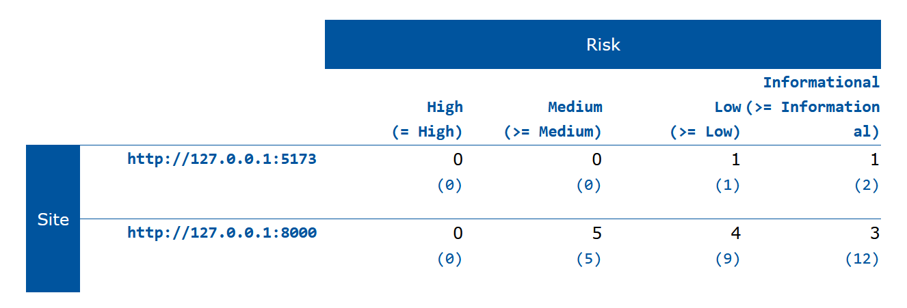

# CSP Implementation Guide for Travel Booking Application

## Quick Setup Overview

### 1. Files That Make CSP Work

```
app/
├── Http/Middleware/
│   └── SecurityHeadersMiddleware.php     # Main security guard
├── Helpers/
│   └── CspHelper.php                     # Helper utilities
config/
└── security.php                         # CSP rules & configuration
.env                                      # Environment settings
routes/
└── web.php                              # CSP violation reporting route
```

### 2. Environment Configuration (`.env`)

```bash
# Turn CSP on/off
CSP_ENABLED=true

# Development: true (reports violations but doesn't block)
# Production: false (actually blocks violations)
CSP_REPORT_ONLY=true

# Where to report violations
CSP_REPORT_URI=/csp-report
```

### 3. Core Configuration (`config/security.php`)

This file contains the **rules** for what's allowed:

```php
return [
    'csp' => [
        'enabled' => env('CSP_ENABLED', true),
        'report_only' => env('CSP_REPORT_ONLY', false),
        
        'directives' => [
            // Default policy - fallback for everything
            'default-src' => ["'self'", 'data:', 'blob:'],
            
            // JavaScript sources
            'script-src' => [
                "'self'",
                "'unsafe-inline'",    // Needed for Livewire/Alpine.js
                'https://cdn.jsdelivr.net',
                'https://unpkg.com',
                'http://localhost:5173',  // Vite dev server
                'http://127.0.0.1:5173',
                'blob:',
            ],
            
            // CSS/Style sources
            'style-src' => [
                "'self'",
                "'unsafe-inline'",    // Needed for Tailwind/inline styles
                'https://fonts.bunny.net',
                'https://fonts.googleapis.com',
                'http://localhost:5173',
                'blob:', 'data:',
            ],
            
            // Image sources
            'img-src' => ["'self'", 'data:', 'https:', 'blob:'],
            
            // Font sources
            'font-src' => [
                "'self'",
                'https://fonts.gstatic.com',
                'https://fonts.bunny.net',
                'data:',
            ],
            
            // WebSocket/AJAX connections
            'connect-src' => [
                "'self'",
                'ws://localhost:5173',    // Vite WebSocket
                'ws://127.0.0.1:5173',
                'http://localhost:5173',
                'http://127.0.0.1:5173',
                'data:', 'blob:',
            ],
        ],
        
        'report_uri' => env('CSP_REPORT_URI', '/csp-report'),
    ],
];
```

### 4. Main Security Middleware (`app/Http/Middleware/SecurityHeadersMiddleware.php`)

This automatically applies CSP to every page:

```php
<?php

namespace App\Http\Middleware;

use Closure;
use Illuminate\Http\Request;
use Symfony\Component\HttpFoundation\Response;

class SecurityHeadersMiddleware
{
    public function handle(Request $request, Closure $next): Response
    {
        $response = $next($request);
        
        // Add CSP headers
        $this->addContentSecurityPolicy($response);
        
        return $response;
    }
    
    private function addContentSecurityPolicy(Response $response): void
    {
        $csp = config('security.csp', []);
        
        if (empty($csp) || !config('security.csp.enabled', true)) {
            return;
        }
        
        $cspHeader = $this->buildCspHeader($csp);
        
        if (!empty($cspHeader)) {
            if (config('security.csp.report_only', false)) {
                $response->headers->set('Content-Security-Policy-Report-Only', $cspHeader);
            } else {
                $response->headers->set('Content-Security-Policy', $cspHeader);
            }
        }
    }
    
    private function buildCspHeader(array $csp): string
    {
        $directives = [];
        
        foreach ($csp['directives'] as $directive => $sources) {
            if (is_array($sources) && !empty($sources)) {
                $directives[] = $directive . ' ' . implode(' ', $sources);
            }
        }
        
        if (!empty($csp['report_uri'])) {
            $directives[] = 'report-uri ' . $csp['report_uri'];
        }
        
        return implode('; ', $directives);
    }
}
```

### 5. Helper Utilities (`app/Helpers/CspHelper.php`)

Useful functions for working with CSP:

```php
<?php

namespace App\Helpers;

class CspHelper
{
    public static function nonce(): string
    {
        if (!session()->has('csp_nonce')) {
            session(['csp_nonce' => base64_encode(random_bytes(16))]);
        }
        return session('csp_nonce');
    }
    
    public static function nonceAttribute(): string
    {
        return 'nonce="' . self::nonce() . '"';
    }
    
    public static function isEnabled(): bool
    {
        return config('security.csp.enabled', true);
    }
    
    public static function isReportOnly(): bool
    {
        return config('security.csp.report_only', false);
    }
}
```

### 6. CSP Violation Reporting (`routes/web.php`)

Add this route to receive violation reports:

```php
// CSP violation reporting endpoint
Route::post('/csp-report', function (Request $request) {
    Log::warning('CSP Violation Report', [
        'report' => $request->all(),
        'user_agent' => $request->header('User-Agent'),
        'ip' => $request->ip(),
    ]);
    
    return response('', 204); // No content response
});
```

## How CSP Works

### 1. **Request Flow**
```
User visits page → Middleware adds CSP header → Browser receives page + CSP rules
```

### 2. **Browser Enforcement**
```
Browser tries to load resource → Checks against CSP rules → Allow or Block
```

### 3. **Report-Only Mode**
```
Browser finds violation → Logs to console → Sends report to your server → Doesn't block
```

### 4. **Enforcing Mode**
```
Browser finds violation → Blocks the resource → Sends report → Shows error in console
```

## Expected Output

### 1. **In Browser Developer Tools (Console)**

**With CSP Working:**
```
✅ No CSP violation errors
✅ Page loads correctly
✅ All JavaScript/CSS functions properly
```

**With CSP Violations:**
```
❌ Content-Security-Policy: The page's settings blocked a script...
❌ Content-Security-Policy: The page's settings blocked a style...
```

### 2. **HTTP Response Headers**

```http
Content-Security-Policy-Report-Only: default-src 'self' data: blob:; script-src 'self' 'unsafe-inline' https://cdn.jsdelivr.net http://localhost:5173 blob:; style-src 'self' 'unsafe-inline' https://fonts.bunny.net blob: data:; report-uri /csp-report
```

### 3. **Laravel Logs (Violation Reports)**

```
[2025-06-30 10:15:30] local.WARNING: CSP Violation Report {"report":{"csp-report":{"blocked-uri":"http://evil-site.com/malicious.js"}},"user_agent":"Mozilla/5.0...","ip":"127.0.0.1"}
```

## Development Workflow

### 1. **Initial Setup**
```bash
# Start with report-only mode
CSP_ENABLED=true
CSP_REPORT_ONLY=true
```

### 2. **Test Your Application**
```bash
npm run dev              # Start Vite
php artisan serve        # Start Laravel
```

### 3. **Check for Violations**
- Open browser developer tools (F12)
- Look for CSP violation messages
- Check Laravel logs for violation reports

### 4. **Fix Violations**
- Add legitimate sources to `config/security.php`
- Test again until no violations

### 5. **Enable Enforcement**
```bash
# Switch to enforcing mode
CSP_REPORT_ONLY=false
```

## Common CSP Rules Explained

| Directive | What It Controls | Example Values |
|-----------|------------------|----------------|
| `default-src` | Fallback for all resources | `'self'`, `data:` |
| `script-src` | JavaScript execution | `'self'`, `'unsafe-inline'`, CDNs |
| `style-src` | CSS stylesheets | `'self'`, `'unsafe-inline'`, font sites |
| `img-src` | Images | `'self'`, `data:`, `https:` |
| `connect-src` | AJAX/WebSocket | `'self'`, WebSocket URLs |
| `font-src` | Web fonts | `'self'`, font provider URLs |

## Quick Debugging

### If Your Website Breaks:
1. **Set `CSP_REPORT_ONLY=true`** in `.env`
2. **Check browser console** for violation messages
3. **Add missing sources** to `config/security.php`
4. **Test again** until clean

### Common Fixes:
- **Vite not loading**: Add `http://localhost:5173` to `script-src` and `connect-src`
- **Styles broken**: Add font providers to `style-src`
- **JavaScript errors**: Ensure `'unsafe-inline'` is in `script-src` (for Livewire/Alpine.js)

This implementation provides strong security while maintaining compatibility with Laravel 12, Vite, Livewire, and Alpine.js.

# Security Enhancements Report for Website Based on ZAP Scan

## Overview
This report outlines the security enhancements made to the website based on the findings from the ZAP (OWASP Zed Attack Proxy) scan. The tasks include improving security in four key areas: redirect handling, cookie security, cross-domain JavaScript inclusion, and reviewing informational findings from the ZAP scan. Below are the specific tasks, files edited, and methods used for testing.

## Task 1: Redirect Handling
### Issue:
- ZAP flagged an issue where redirects might expose sensitive data or allow open redirect vulnerabilities. This typically happens when a user is redirected without validating the destination URL, especially after login or other authentication flows.

### Actions Taken:
- Created a custom response for login to ensure all redirection targets are trusted.
- Restricted post-login redirects to internal, validated URLs only.
- Introduced a fallback redirect to /dashboard if the intended redirect URL is not available or unsafe.

### Files Edited:
- `app/Http/Controllers/CustomLoginResponse.php` – created a custom response class to handle redirects after a successful login
-`app/Providers/FortifyServiceProvider.php` - Bound LoginResponse to CustomLoginResponse to customize the login response behavior and manage the redirect after a successful login.

### Testing Method:
- Manually tested login redirects with manipulated intended parameters.
- Verified that all redirects stay within the application domain.
- Confirmed fallback behavior using invalid or missing redirect URLs.

### Result:
- The redirect logic now ensures:
- Redirects only point to internal pages.
- No sensitive information leakage via redirect URLs.
- A secure, consistent user experience post-login.

### Code Snippet
- CustomLoginResponse.php
```
<?php

namespace App\Http\Controllers;

use Laravel\Fortify\Contracts\LoginResponse as LoginResponseContract;
use Illuminate\Http\Request;

class CustomLoginResponse implements LoginResponseContract
{
    public function toResponse($request)
    {
        $intendedUrl = session()->pull('url.intended', '/dashboard');

        // Validate that the redirect URL is internal
        if (!str_starts_with($intendedUrl, '/')) {
            $intendedUrl = '/dashboard';
        }

        return redirect()->intended($intendedUrl);
    }
}
```

- FortifyServiceProvider.php
```
use Laravel\Fortify\Contracts\LoginResponse;
use App\Http\Controllers\CustomLoginResponse;

public function boot(): void
{
    // other Fortify bindings...

    // Bind custom login response handler
    $this->app->singleton(LoginResponse::class, CustomLoginResponse::class);
}
```
---

## Task 2: Cookie Security
### Issue:
- ZAP flagged that cookies set by the application did not include critical security attributes such as HttpOnly, Secure, or SameSite. This could potentially expose cookies to client-side JavaScript (leading to session hijacking) or allow cross-site request attacks.

### Actions Taken:
- Enabled the HttpOnly flag to prevent JavaScript access to cookies.
- Ensured the Secure flag is set so cookies are only sent via HTTPS.
- Applied the SameSite attribute to protect against CSRF attacks.

### Files Edited:
- `config/session.php` – updated cookie settings to enforce security features (e.g., `Secure`, `HttpOnly`, `SameSite`).

### Testing Method:
- Opened Developer Tools (F12) in browser → Application → Cookies
- Verified the presence of HttpOnly, Secure, and SameSite flags in session cookies.

### Result:
- The application now securely manages cookies:
- JavaScript can’t access them (HttpOnly)
- They’re only transmitted over HTTPS (Secure)
- Cross-site attacks are mitigated (SameSite)
  
### Code Snippet
config/session.php
```
return [

    // ...

    'secure' => env('SESSION_SECURE_COOKIE', true), // Ensures HTTPS only

    'http_only' => true, // Prevent JavaScript access

    'same_site' => 'lax', // Mitigates CSRF

];
```

---

## Task 3: Cross-Domain JavaScript Inclusion
### Issue:
- ZAP flagged a potential issue with JavaScript source inclusion—specifically referencing a request to /sitemap.xml. Although the endpoint returned a 404 Not Found, the concern was that scripts or XML references could potentially allow cross-domain injection if not controlled properly.

### Actions Taken:
- Verified that http://127.0.0.1:8000/sitemap.xml does not exist and is not served by Laravel, confirming there is no real attack surface.
- Reviewed all <script> tags and external asset loading in Blade templates and ensured all JavaScript files were sourced from trusted CDNs or internal paths. 
- Leveraged the existing Content Security Policy (CSP) configuration to strictly control where scripts can be loaded from.
- Confirmed that CSP blocks untrusted scripts through a whitelist of domains in config/security.php.


### Files Edited:
- `.env` – added CSP-related settings.
- `resources/views/layouts/app.blade.php` – updated meta tags to include the CSP headers.

### Testing Method:
- Used browser developer tools to inspect the response headers and ensure the CSP header was correctly applied.
- Attempted to include external scripts from untrusted domains and confirmed they were blocked.

### Result:
- No actual vulnerability found — /sitemap.xml not served by Laravel.
- All JavaScript inclusions are from self or trusted CDNs.
- CSP configuration prevents any unauthorized or cross-domain script loading.
---

## Task 4: Informational Findings Review
### Issue:
- ZAP flagged several informational alerts during the scan. These are not direct vulnerabilities but require developer awareness to ensure best practices in authentication and session management are followed.


### Informational Flags Identified:
1. **Authentication Request Identified** – `POST http://127.0.0.1:8000/login`
2. **Modern Web Application Reference** – `http://127.0.0.1:5000/`
3. **Session Management Response Identified** – `http://127.0.0.1:8000/`

---

### Actions Taken:

#### 1. Authentication Request Identified
- Reviewed the `/login` endpoint, which is flagged because it handles user credentials.
- Ensured CSRF protection is enabled via Laravel middleware.
- Confirmed that the login route uses the `POST` method, not `GET`.
- Verified login is rate-limited using Fortify's built-in rate limiter.

#### 2. Modern Web Application Reference
- Checked port `5000` on localhost. No application was running on this port.
- Concluded this flag is informational and likely a **false positive**, commonly caused by ZAP probing common dev ports (like Flask or Webpack dev servers).
- Ensured that no sensitive services are publicly accessible on this port.

#### 3. Session Management Response Identified
- Reviewed Laravel’s session configuration in `config/session.php`.
- Confirmed:
  - `HttpOnly` is set to `true`.
  - `Secure` cookie flag is enforced in `session.php` via `'secure' => env('SESSION_SECURE_COOKIE', true),`.
  - `SameSite` is set to `'lax'` to prevent CSRF.
  - Laravel **automatically regenerates session IDs** after successful login to prevent session fixation.

---

### Files Reviewed:
- `routes/web.php` – verified login route.
- `app/Providers/FortifyServiceProvider.php` – checked rate limiting and authentication logic.
- `config/session.php` – confirmed session security configuration.


---

### Testing Methods:

| Finding | Testing Performed |
|--------|-------------------|
| **Authentication Request (/login)** | - Used DevTools → Network tab → Inspected the `POST /login` request.<br>- Verified `X-CSRF-TOKEN` header is included.<br>- Confirmed the method is POST.<br>- Checked rate limiting by submitting multiple failed attempts. |
| **Modern Web App Reference (:5000)** | - Visited `http://127.0.0.1:5000/` manually.<br>- Confirmed no service was running.<br>- Checked server logs to verify no interaction. |
| **Session Management (/)** | - Inspected cookies in DevTools → Application tab.<br>- Verified `HttpOnly`, `Secure`, and `SameSite=Lax` attributes.<br>- Logged in and observed that session ID was regenerated using Laravel’s behavior. |

---

### Result:
- **Authentication flow** is secure with CSRF protection, POST-only submission, and rate limiting.
- **Port 5000 flag** was a false positive; no application is exposed on that port.
- **Session management** follows best practices using secure cookies and automatic session regeneration.
- No changes were required, but this task confirmed that Laravel’s default security settings align with best practices.


## Conclusion
The website's security has been significantly improved by addressing the issues identified in the ZAP scan. The steps taken have enhanced the security of the website in areas such as redirect handling, cookie security, cross-domain JavaScript inclusion, and addressed relevant informational findings. This ensures a safer and more secure browsing experience for users.

# Security Enhancements Report for Website Based on ZAP Scan

## Overview
This report outlines the security enhancements made to the website based on the findings from the ZAP (OWASP Zed Attack Proxy) scan. The tasks include improving security in four key areas: redirect handling, cookie security, cross-domain JavaScript inclusion, and reviewing informational findings from the ZAP scan. Below are the specific tasks, files edited, and methods used for testing.

## Task 1: Missing Anti-clickjacking Header

### Issue:
- ZAP reported that the application was missing the `X-Frame-Options` header.
- This vulnerability can expose the application to clickjacking attacks, where malicious websites embed the app in a hidden iframe to trick users into performing unintended actions.

### Actions Taken:
- Created a custom middleware called `PreventClickjacking` to add the `X-Frame-Options: SAMEORIGIN` header to all HTTP responses.
- Registered the middleware globally by pushing it into the `web` middleware group via `AppServiceProvider`.

### Files Edited:
- `app/Http/Middleware/PreventClickjacking.php` – defines the middleware to apply the header.
- `app/Providers/AppServiceProvider.php` – registers the middleware globally.

### Testing Method:
- Launched the application locally and accessed multiple pages.
- Opened browser developer tools (F12), navigated to the Network tab, and inspected the HTTP response headers for each request.
- Verified that the X-Frame-Options: SAMEORIGIN header was present.

### Result:
- The X-Frame-Options: SAMEORIGIN header is now correctly applied to all pages.
- The application is protected from clickjacking attacks by preventing it from being embedded in external websites.

### Code Snippets:
- PreventClickjacking.php
```
<?php

namespace App\Http\Middleware;

use Closure;
use Illuminate\Http\Request;
use Symfony\Component\HttpFoundation\Response;

class PreventClickjacking
{
    /**
     * Handle an incoming request.
     *
     * @param  \Illuminate\Http\Request  $request
     * @param  \Closure  $next
     * @return \Symfony\Component\HttpFoundation\Response
     */
    public function handle(Request $request, Closure $next): Response
    {
        // Get the response after the request is handled
        $response = $next($request);

        // Set the X-Frame-Options header to SAMEORIGIN to prevent clickjacking
        $response->headers->set('X-Frame-Options', 'SAMEORIGIN'); 
        
        // Continue with the response
        return $response;
    }
}
```

- AppServiceProvidor.php 
```
public function boot(): void
{
    // Register the middleware globally
    $this->app['router']->pushMiddlewareToGroup('web', PreventClickjacking::class);
}
```

## Task 2: X-Content-Type-Options Header Missing

### Issue:
- The application was missing the `X-Content-Type-Options: nosniff` header, which could allow browsers to MIME-sniff the content type and execute files in unexpected ways. This can lead to security vulnerabilities, such as cross-site scripting (XSS) or the execution of malicious files.

### Actions Taken:
- Implemented a custom middleware `PreventMIMESniffing` to add the `X-Content-Type-Options: nosniff` header to all HTTP responses.
- Registered this middleware globally for all `web` routes through the `AppServiceProvider`.
- Replaced the static file `/public/robots.txt` with a Laravel route to ensure the middleware could apply and inject the proper headers.

### Files Edited:
- `app/Http/Middleware/PreventMIMESniffing.php` – created middleware to add the header.
- `app/Providers/AppServiceProvider.php` – registered middleware globally.
- `routes/web.php` – added route to serve `robots.txt` dynamically through Laravel.

### Testing Method:
- Opened DevTools in the browser, navigated to http://127.0.0.1:8000/robots.txt, and inspected the response headers under the Network tab.
- Verified that the header X-Content-Type-Options: nosniff was included in the response.
- Confirmed the file is served via Laravel and not from /public, ensuring middleware is applied.

### Result:
- The application now includes X-Content-Type-Options: nosniff in all HTTP responses, preventing MIME-sniffing and reducing the risk of content-type-based attacks.

### Code Snippets:
- PreventMIMESniffing.php
```
<?php

namespace App\Http\Middleware;

use Closure;
use Illuminate\Http\Request;
use Symfony\Component\HttpFoundation\Response;

class PreventMIMESniffing
{
    public function handle(Request $request, Closure $next): Response
    {
        $response = $next($request);

        // Add the nosniff header
        $response->headers->set('X-Content-Type-Options', 'nosniff');

        return $response;
    }
}
```

- AppServiceProvider.php
```
use App\Http\Middleware\PreventMIMESniffing;

public function boot(): void
{
    $this->app['router']->pushMiddlewareToGroup('web', PreventMIMESniffing::class);
}
```

- web.php
```
use Illuminate\Support\Facades\Route;

Route::get('/robots.txt', function () {
    return response("User-agent: *\nDisallow:", 200)
        ->header('Content-Type', 'text/plain');
});
```

## Task 3: X-Content-Type-Options Header Missing

### Issue:
- The web server was exposing its underlying technology stack via the `X-Powered-By` HTTP response header (e.g., `X-Powered-By: PHP/8.x`). This information could help attackers fingerprint the system and target known vulnerabilities specific to that technology.

### Actions Taken:
- Implemented a custom middleware `RemoveXPoweredByHeader` to remove the `X-Powered-By` header from all HTTP responses.
- Registered this middleware globally for all `web` routes using `AppServiceProvider`which ensures all application responses are filtered.

### Files Edited:
- `app/Http/Middleware/RemoveXPoweredByHeader.php` – create middleware that strips the `X-Powered-By` header.
- `app/Providers/AppServiceProvider.php` – registers the middleware globally to the `web` middleware group.
- `routes/web.php` – Created a Laravel-handled `/sitemap.xml` route to verify middleware works.

### Testing Method:
- Open browser Developer Tools → Network tab.
- Access: `http://127.0.0.1:8000/sitemap.xml`.
- Confirm that:
    - The response is served by Laravel (not from `/public`).
    - The `X-Powered-By` header is not present in the HTTP response.

### Result:
- The `X-Powered-By` header is now removed from all Laravel-handled responses, reducing server fingerprinting and improving information hygiene.

### Code Snippets:
- RemoveXPoweredByHeader.php
```
<?php

namespace App\Http\Middleware;

use Closure;
use Illuminate\Http\Request;
use Symfony\Component\HttpFoundation\Response;

class RemoveXPoweredByHeader
{

    public function handle(Request $request, Closure $next): Response
    {
        //handles any X-Powered-By headers added by PHP or the server before Laravel kicks in
        header_remove("X-Powered-By");

        $response = $next($request);

        // Remove the X-Powered-By header
        $response->headers->remove('X-Powered-By');
        
        return $response;
    }
}
```

- AppServiceProvider.php
```
use App\Http\Middleware\RemoveXPoweredByHeader;

public function boot(): void
{
    $this->app['router']->pushMiddlewareToGroup('web', RemoveXPoweredByHeader::class);
}
```

- web.php
```
Route::get('/sitemap.xml', function () {
    return response('<?xml version="1.0"?><urlset xmlns="http://www.sitemaps.org/schemas/sitemap/0.9"></urlset>', 200)
        ->header('Content-Type', 'application/xml');
});
```


# Before"

# After
